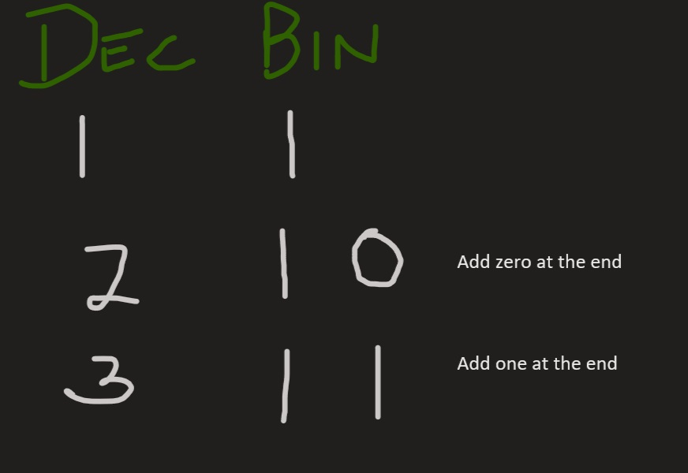
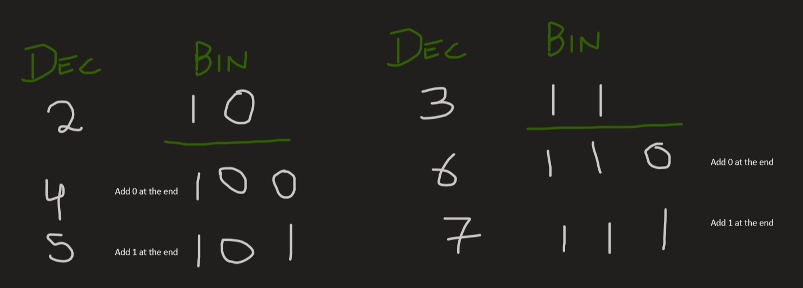
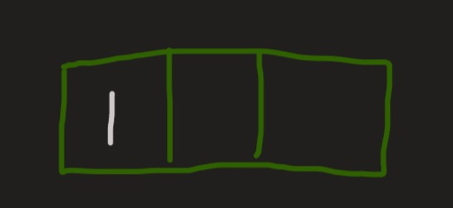
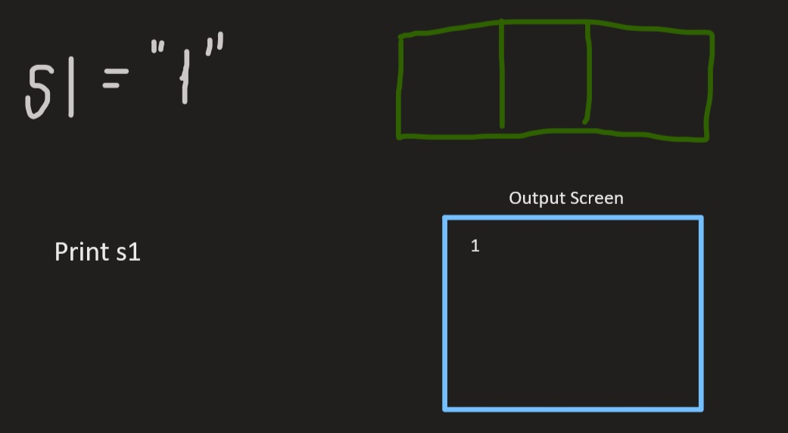

# Binary Queue
Given a number N, print all possible binary numbers with decimal values from 1 to N, but the catch is you have to do this using queue data structure and not recursion. (You have to use the minimum number of bits needed to represent the number).

**Input format**

The first line of the input contains a variable T, denoting the number of test cases.
Each of the next T lines contains one integer N denoting the input number.

**Output format**

For each test case print the required binary representation of the numbers from 1 to N.

**Constraints**

1<=T<=30

1<=N<=10000

**Example**

*Input*

2
4
5

*Output*

1 10 11 100
1 10 11 100 101

##Approach | [Code](/StoreRoom/BinaryQueue/BinaryQueue.java)

Let me tell you something amazing about the binary numbers.
Look at this pattern.
* If we start with *1 (binary)* and **append 0 to its end** and then **1 to its end**, then we get the next number i.e **10,11**.

* Now Repeat this process with newly generated binary number(10,11).
**Append 0 & 1** at the end of **10** and then at the end of **11**.

* Tada!!😁 we have our next numbers. You can keep doing this to generate new numbers by just appending 0 & 1 at the end of the newly formed binary numbers.

Now you have the idea.
Let's see 👀 how Queue [🚶‍♂️🚶‍♂️🚶‍♂️🚶‍♂️] can be helpful.
This code is taken from the [GeekForGeeks](https://www.geeksforgeeks.org/interesting-method-generate-binary-numbers-1-n/). I am just trying to elaborate it.
```java
    static void generatePrintBinary(int n) 
    { 
        // Create an empty queue of strings 
        Queue<String> q = new LinkedList<String>(); 
          
        // Enqueue the first binary number 
        q.add("1"); 
      
        while(n-- > 0) 
        { 
            // print the front of queue 
            String s1 = q.peek(); 
            q.remove(); 
            System.out.println(s1); 
              
            // Make a copy of s1 so we can append 0 to s1 and 1 to s2.
            String s2 = s1; 
              
            // Append "0" to s1 and enqueue it 
            q.add(s1 + "0"); 
              
            // Append "1" to s2 and enqueue it.
            q.add(s2 + "1"); 
        } 
    } 
```
The code is doing this.
* It add 1 to the queue

* Remove it from the Queue; Store it in s1 and print it.

* We make a copy of s1 in s2. 
```java
String s2 = s1;
// Append "0" to s1 and enqueue it 
q.add(s1 + "0"); 
// Append "1" to s2 and enqueue it.
q.add(s2 + "1");  
```
This is because we need to **add 0 to the s1** and **1 to the s2** to get next binary numbers i.e.(10,11)
* Now Queue is this.

* Repeat this process.
 > Pull 10 out in s1.       
 Print s1 => 10
 Make a copy of it in s2 | s1=10, s2=10
 Append 0 to s1 | s1=100
 Apeend 1 to s2 | s2=101
 Insert them to the Queue.

  
* Keep doing it till n become 0.                       
* Happy Ending!!(I hope so😅)